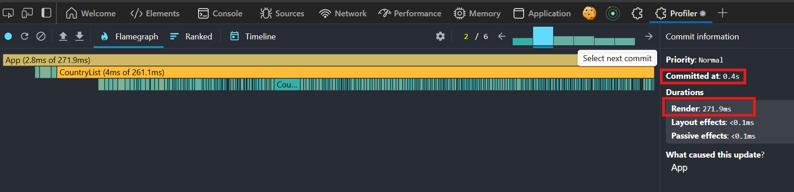
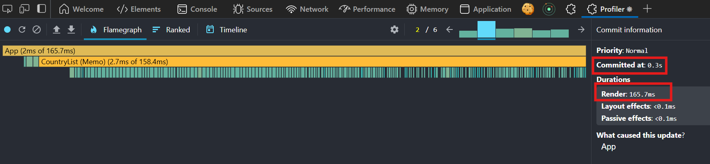
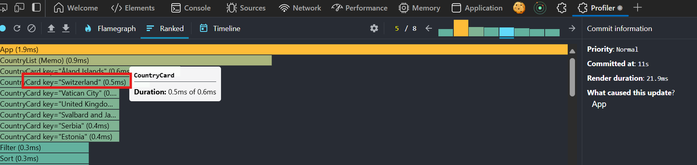
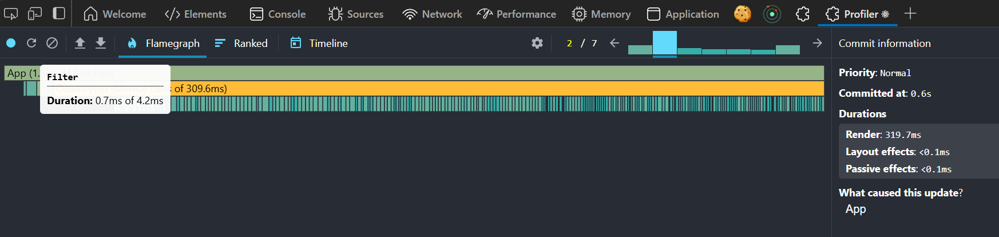
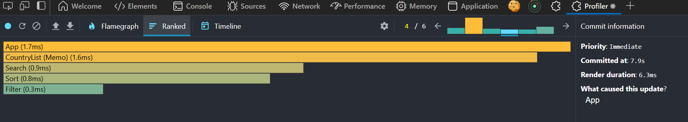

# React Dev Tools - Performance Profiler

This document outlines the performance improvements made to the application using React's memoization tools (`React.memo`, `useMemo`, and `useCallback`). Below are the performance metrics before and after applying these optimizations.

---

## Performance Metrics

### 1. **Before Adding Any Memoization Tools**
The initial performance of the application without any optimizations:

---

### 2. **After Adding `React.memo` to `CardList` Component**
Performance improvement after memoizing the `CardList` component:

---

### 3. **Before Adding `React.memo` to `Card` Component**
Performance before memoizing individual `Card` components:

---

### 4. **After Adding `React.memo` to `Card` Component**
Performance after memoizing individual `Card` components:

---

### 5. **Before Adding `useMemo` to `filteredCountries` List**
Performance before memoizing the `filteredCountries` list:

---

### 6. **After Adding `useMemo` to `filteredCountries` List**
Performance after memoizing the `filteredCountries` list:

---

### 7. **After Adding `useCallback` to Event Handlers**
Performance after memoizing event handlers with `useCallback`:

---

## Conclusion
As seen from the charts, the performance of the application improved significantly after applying the following optimizations:
1. Memoizing the `CardList` and `Card` components using `React.memo`.
2. Memoizing the `filteredCountries` list using `useMemo`.
3. Memoizing event handlers using `useCallback`.

These changes reduced unnecessary re-renders and improved the overall efficiency of the application, especially after fetching the countries' data initially.