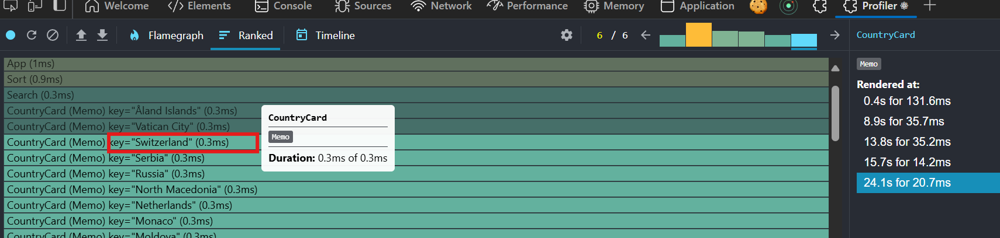
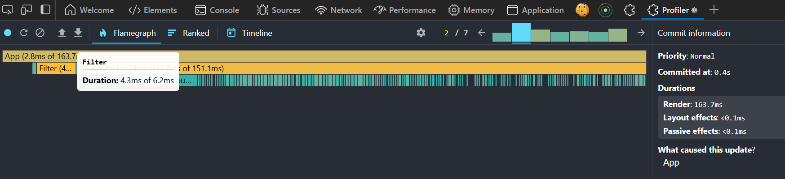

React Dev Tools

Performace Profiler

* Before adding any memoization tools, the application performance is like the following.
  
* After adding memo to CardList component.
  
* Before adding memo to Card
  
* After adding memo to Card
  
* Before adding useMemo to filteredCountries list
  
* After adding useMemo
  
* After adding useCallbacks
  